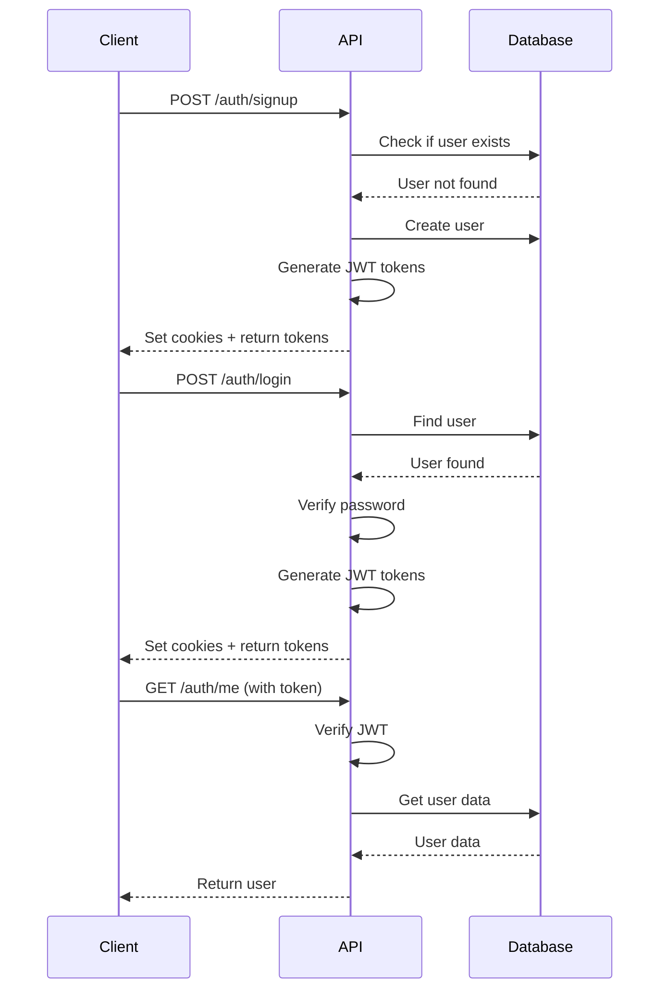
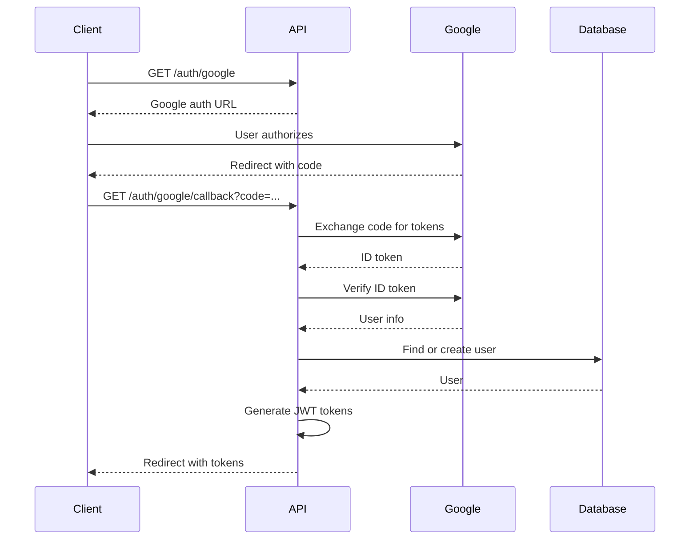

# API Documentation - Smart Price Tracker

**Base URL:** `http://localhost:4000/api/v1` (Development)

**Content-Type:** `application/json`

---

## Table of Contents
- [Authentication](#authentication)
- [Error Handling](#error-handling)
- [Rate Limiting](#rate-limiting)

---

## Authentication

All protected endpoints require a valid JWT token in the Authorization header:
```
Authorization: Bearer <access_token>
```

Alternatively, the token is automatically sent via HttpOnly cookie.

---

## Endpoints

### Health Check

#### Get API Health Status
```http
GET /health
```

**Response:**
```json
{
  "status": "OK",
  "timestamp": "2026-02-21T10:00:00.000Z"
}
```

---

### Authentication Endpoints

#### 1. User Signup

Create a new user account.

```http
POST /api/v1/auth/signup
```

**Request Body:**
```json
{
  "email": "user@example.com",
  "username": "johndoe",
  "password": "SecurePass123",
  "confirmPassword": "SecurePass123",
  "name": "John Doe"  // Optional
}
```

**Validation Rules:**
- `email`: Must be valid email format
- `username`: 3-30 characters
- `password`: Minimum 8 characters
- `confirmPassword`: Must match password
- `name`: Optional string

**Success Response (201 Created):**
```json
{
  "success": true,
  "message": "Account created successfully",
  "data": {
    "user": {
      "id": "clxy123abc...",
      "email": "user@example.com",
      "username": "johndoe",
      "name": "John Doe",
      "createdAt": "2026-02-21T10:00:00.000Z"
    },
    "accessToken": "eyJhbGciOiJIUzI1NiIsInR5cCI6IkpXVCJ9..."
  }
}
```

**Error Response (400 Bad Request):**
```json
{
  "success": false,
  "message": "Email already registered"
}
```

**Cookies Set:**
- `accessToken` (HttpOnly, 7 days)
- `refreshToken` (HttpOnly, 30 days)

---

#### 2. User Login

Authenticate an existing user.

```http
POST /api/v1/auth/login
```

**Request Body:**
```json
{
  "emailOrUsername": "user@example.com",  // or "johndoe"
  "password": "SecurePass123",
  "rememberMe": false  // Optional, default: false
}
```

**Success Response (200 OK):**
```json
{
  "success": true,
  "message": "Login successful",
  "data": {
    "user": {
      "id": "clxy123abc...",
      "email": "user@example.com",
      "username": "johndoe",
      "name": "John Doe"
    },
    "accessToken": "eyJhbGciOiJIUzI1NiIsInR5cCI6IkpXVCJ9..."
  }
}
```

**Error Response (401 Unauthorized):**
```json
{
  "success": false,
  "message": "Invalid credentials"
}
```

**Cookie Duration:**
- Without `rememberMe`: 7 days
- With `rememberMe`: 30 days

---

#### 3. User Logout

Log out the current user.

```http
POST /api/v1/auth/logout
```

**Headers:**
```
Authorization: Bearer <access_token>
```

**Success Response (200 OK):**
```json
{
  "success": true,
  "message": "Logout successful"
}
```

**Behavior:**
- Clears authentication cookies

---

#### 4. Get Current User

Get authenticated user's profile.

```http
GET /api/v1/auth/me
```

**Headers:**
```
Authorization: Bearer <access_token>
```

**Success Response (200 OK):**
```json
{
  "success": true,
  "data": {
    "user": {
      "id": "clxy123abc...",
      "email": "user@example.com",
      "username": "johndoe",
      "name": "John Doe",
      "createdAt": "2026-02-21T10:00:00.000Z"
    }
  }
}
```

**Error Response (401 Unauthorized):**
```json
{
  "success": false,
  "message": "Unauthorized"
}
```

---

### Google OAuth Endpoints

#### 5. Initiate Google OAuth

Get Google authorization URL.

```http
GET /api/v1/auth/google
```

**Success Response (200 OK):**
```json
{
  "success": true,
  "data": {
    "authUrl": "https://accounts.google.com/o/oauth2/v2/auth?..."
  }
}
```

**Usage:**
```javascript
// Frontend implementation
const response = await fetch('/api/v1/auth/google');
const { data } = await response.json();
window.location.href = data.authUrl;  // Redirect to Google
```

---

#### 6. Google OAuth Callback

Handle Google OAuth callback (automatic redirect).

```http
GET /api/v1/auth/google/callback?code=<auth_code>
```

**Query Parameters:**
- `code`: Authorization code from Google

**Behavior:**
1. Exchanges code for tokens
2. Verifies user with Google
3. Creates or links user account
4. Sets authentication cookies
5. Redirects to frontend

**Success Redirect:**
```
http://localhost:5173/auth/callback?success=true&token=<access_token>&user=<user_data>
```

**Error Redirect:**
```
http://localhost:5173/auth/callback?success=false&error=<error_message>
```

---

#### 7. Google Token Authentication

Authenticate using Google ID token (client-side flow).

```http
POST /api/v1/auth/google/token
```

**Request Body:**
```json
{
  "idToken": "eyJhbGciOiJSUzI1NiIsImtpZCI6..."
}
```

**Success Response (200 OK):**
```json
{
  "success": true,
  "message": "Google authentication successful",
  "data": {
    "user": {
      "id": "clxy123abc...",
      "email": "user@gmail.com",
      "name": "John Doe",
      "googleId": "1234567890"
    },
    "accessToken": "eyJhbGciOiJIUzI1NiIsInR5cCI6IkpXVCJ9..."
  }
}
```

**Usage:**
```javascript
// Frontend with @react-oauth/google
import { GoogleOAuthProvider, GoogleLogin } from '@react-oauth/google';

<GoogleLogin
  onSuccess={async (credentialResponse) => {
    const response = await fetch('/api/v1/auth/google/token', {
      method: 'POST',
      headers: { 'Content-Type': 'application/json' },
      body: JSON.stringify({ idToken: credentialResponse.credential })
    });
    const data = await response.json();
    // Handle successful authentication
  }}
  onError={() => console.log('Login Failed')}
/>
```

---

## Error Handling

### Error Response Format

All error responses follow this format:

```json
{
  "success": false,
  "message": "Human-readable error message",
  "errors": [  // Optional, for validation errors
    {
      "field": "email",
      "message": "Invalid email address"
    }
  ]
}
```

### HTTP Status Codes

| Code | Meaning | When Used |
|------|---------|-----------|
| 200 | OK | Successful GET, DELETE, or update |
| 201 | Created | Successful POST (resource created) |
| 400 | Bad Request | Invalid input, validation errors |
| 401 | Unauthorized | Missing or invalid authentication |
| 403 | Forbidden | Authenticated but not authorized |
| 404 | Not Found | Resource doesn't exist |
| 409 | Conflict | Resource already exists |
| 500 | Internal Server Error | Server-side error |

### Common Error Examples

**Validation Error (400):**
```json
{
  "success": false,
  "message": "Validation error",
  "errors": [
    {
      "path": ["email"],
      "message": "Invalid email address"
    },
    {
      "path": ["password"],
      "message": "Password must be at least 8 characters"
    }
  ]
}
```

**Unauthorized (401):**
```json
{
  "success": false,
  "message": "No token provided"
}
```

**Resource Conflict (409):**
```json
{
  "success": false,
  "message": "Email already registered"
}
```

---

## Authentication Flow

### Standard Email/Password Flow



### Google OAuth Flow



---

## Rate Limiting

**Status:** Not implemented (planned)

**Recommended limits:**
- Authentication endpoints: 5 requests/minute per IP
- General API: 100 requests/minute per user

---

## CORS Policy

**Allowed Origins:**
- Development: `http://localhost:5173`
- Production: Configured via `CORS_ORIGIN` environment variable

**Credentials:** Allowed (for cookies)

---

## Security Headers

**Cookies:**
- `httpOnly: true` - Prevents XSS access
- `secure: true` - HTTPS only (production)
- `sameSite: 'strict'` - CSRF protection

**Token Expiry:**
- Access Token: 7 days
- Refresh Token: 30 days

---

## Testing the API

### Using cURL

**Signup:**
```bash
curl -X POST http://localhost:4000/api/v1/auth/signup \
  -H "Content-Type: application/json" \
  -d '{
    "email": "test@example.com",
    "username": "testuser",
    "password": "Test123456",
    "confirmPassword": "Test123456",
    "name": "Test User"
  }'
```

**Login:**
```bash
curl -X POST http://localhost:4000/api/v1/auth/login \
  -H "Content-Type: application/json" \
  -d '{
    "emailOrUsername": "test@example.com",
    "password": "Test123456"
  }'
```

**Get Current User:**
```bash
curl -X GET http://localhost:4000/api/v1/auth/me \
  -H "Authorization: Bearer YOUR_ACCESS_TOKEN"
```

### Using Postman

1. Import collection from `/postman` directory (if available)
2. Set environment variable `base_url` to `http://localhost:4000`
3. After login, the access token is automatically set for subsequent requests

### Using JavaScript (Frontend)

```javascript
// Signup
const signup = async (userData) => {
  const response = await fetch('http://localhost:4000/api/v1/auth/signup', {
    method: 'POST',
    headers: { 'Content-Type': 'application/json' },
    credentials: 'include',  // Important for cookies
    body: JSON.stringify(userData)
  });
  return response.json();
};

// Login
const login = async (credentials) => {
  const response = await fetch('http://localhost:4000/api/v1/auth/login', {
    method: 'POST',
    headers: { 'Content-Type': 'application/json' },
    credentials: 'include',
    body: JSON.stringify(credentials)
  });
  return response.json();
};

// Get current user
const getCurrentUser = async () => {
  const response = await fetch('http://localhost:4000/api/v1/auth/me', {
    headers: {
      'Authorization': `Bearer ${localStorage.getItem('accessToken')}`
    },
    credentials: 'include'
  });
  return response.json();
};
```

---

## Changelog

### Version 1.0 (Current)
- ✅ User signup with email/password
- ✅ User login
- ✅ User logout
- ✅ Get current user
- ✅ Google OAuth flow
- ✅ JWT token authentication

### Upcoming (Version 1.1)
- 🔄 Product tracking endpoints
- 🔄 Price history endpoints
- 🔄 Alert management endpoints
- 🔄 Rate limiting
- 🔄 Email verification

---

**Last Updated:** February 21, 2026  
**API Version:** 1.0  
**Maintained by:** Smart Price Tracker Development Team
